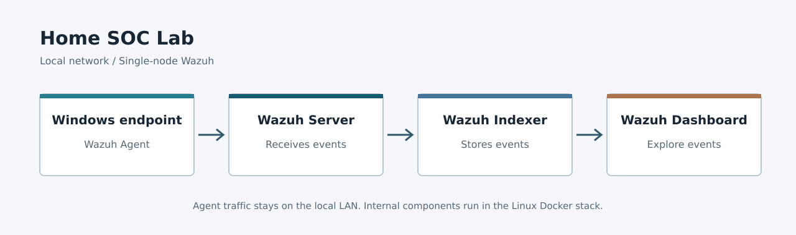
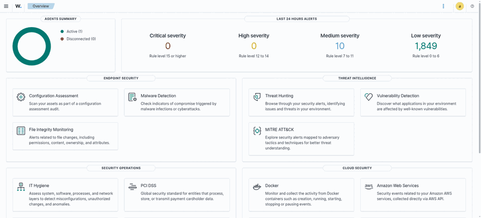
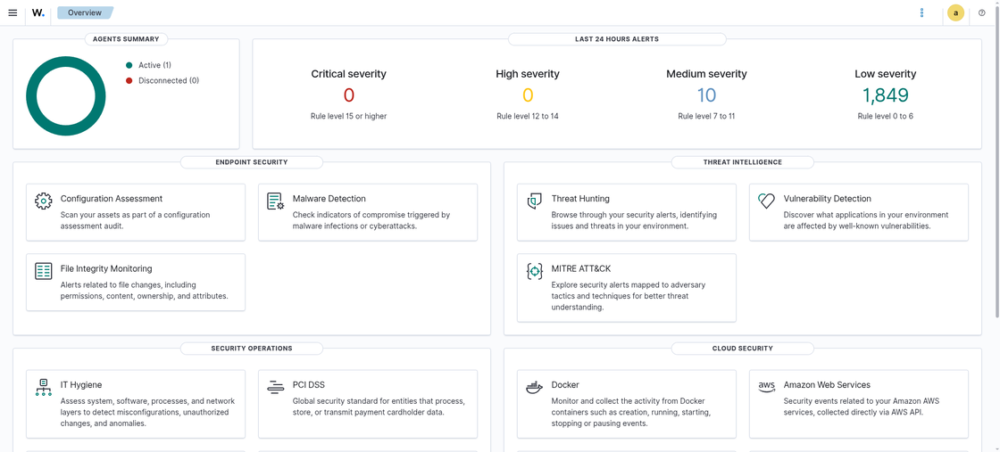
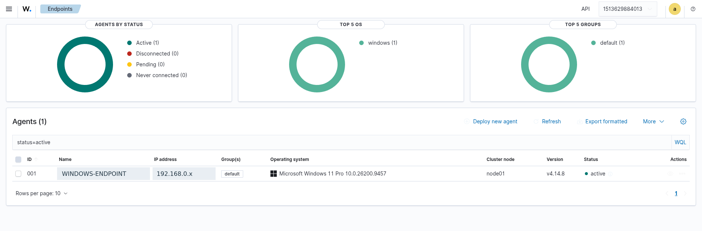
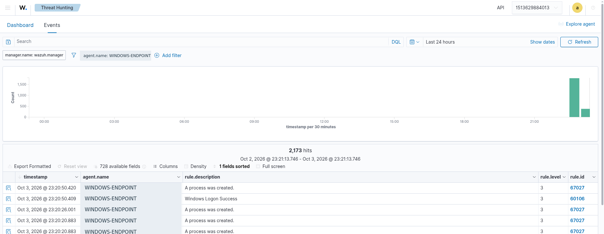
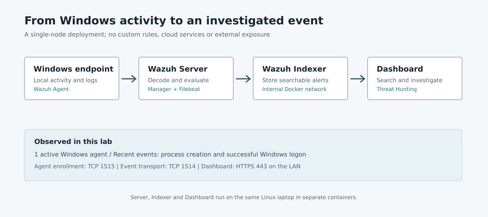

# Home SOC Lab

A two-laptop, LAN-only security monitoring lab. A Windows endpoint sends events to a Wazuh single-node stack on a Linux laptop; the dashboard makes those events searchable. This is an evidence-backed MVP, not a production SOC or an attack-detection benchmark.

**Stack:** Wazuh 4.14.8 | Docker Compose | Windows 11 agent | EndeavourOS host

## Demo

The animation below is a slideshow of three real, redacted Wazuh screenshots, **not** a recording of live interaction.

| Overview | Windows endpoint |
| :---: | :---: |
|  |  |

**Windows events:** Threat Hunting was filtered to the Windows agent and the last 24 hours. The captured results include a successful Windows logon and process creation events. These are routine telemetry, not proof of an attack.

## Architecture

| Component | Role |
| --- | --- |
| Windows Wazuh Agent | Collects endpoint telemetry and connects to the manager over the local network. |
| Wazuh Server | Enrolls agents, receives their events, decodes and evaluates them. Filebeat forwards alerts. |
| Wazuh Indexer | Stores searchable Wazuh data. |
| Wazuh Dashboard | Provides agent status and Threat Hunting views. |

The three central components run as separate containers on the same Linux laptop using the [official Wazuh Docker single-node deployment](https://documentation.wazuh.com/current/deployment-options/docker/wazuh-container.html). Agent enrollment uses TCP 1515, agent events use TCP 1514, and the dashboard uses HTTPS 443. The indexer (9200) and manager API (55000) are bound to localhost on the host; no router port forwarding or public Internet exposure was configured.

## What Was Verified

- The Wazuh Server, Indexer and Dashboard containers were running; the indexer cluster was GREEN.
- The Windows agent registered and displayed as **Active** in the Endpoints view.
- The dashboard accepted login and displayed recent alerts from the Windows agent in Threat Hunting, including `Windows Logon Success` and `A process was created.`
- The manager's Filebeat connected to the indexer. A direct authenticated request to the manager API succeeded.

These checks were made locally on the Linux server. The Windows service startup mode (`Automatic`) and a direct browser connection **from Windows** are not evidenced by this repository. No screenshot of PowerShell has been fabricated.

## Reproduce Safely

1. Prepare two laptops on the same LAN: one Linux Docker host and one Windows endpoint. Review the [Wazuh Docker requirements](https://documentation.wazuh.com/current/deployment-options/docker/wazuh-container.html) first: the single-node stack needs at least 4 CPU cores, 8 GB RAM and 50 GB storage allocated for images and data.
2. Use the official `wazuh/wazuh-docker` `v4.14.8` single-node instructions to generate certificates and start Server, Indexer and Dashboard. Change the published demo credentials using the [official password procedure](https://documentation.wazuh.com/current/deployment-options/docker/changing-default-password.html) before making the dashboard accessible on the LAN.
3. On Windows, install the [official Wazuh Agent](https://documentation.wazuh.com/current/installation-guide/wazuh-agent/wazuh-agent-package-windows.html) with the Linux host's current LAN address as manager. Allow only the required local-network connections; do not expose these services to the public Internet.
4. Confirm the agent is **Active** in Endpoints. Open Threat Hunting, select **Events**, set a recent time window and filter on that agent. Inspect actual records rather than assuming registration implies events are flowing.

This is documentation and redacted evidence, **not** a copy of the live deployment. Do not use this README as a one-command installer. On the original Linux host, `docker compose ps` and `docker compose logs` provide health checks; `docker compose stop` preserves volumes when shutting down the lab.

## Evidence and Privacy

Screenshots were captured from the running Wazuh UI. The endpoint hostname and private IP were replaced with `WINDOWS-ENDPOINT` and `192.168.0.x` **in the images only**; the real agent identity was not changed in Wazuh. Counters and event descriptions reflect the capture time and will vary. The architecture illustrations are diagrams, not screenshots.

Do not publish credentials, session URLs, TLS private keys, agent keys, raw event exports with personal data, or the local Docker configuration containing passwords. The missing Windows service screenshot should be captured on Windows only after verifying `WazuhSvc` is `Running` with startup type `Automatic`, and reviewed for private data before adding it.

## Scope

The MVP demonstrates endpoint enrollment, event transport, storage and investigation. It does not include custom detection rules, Sysmon, Suricata, cloud infrastructure, notifications, a VPN or public exposure. Routine process/logon events should not be presented as confirmed threats.
